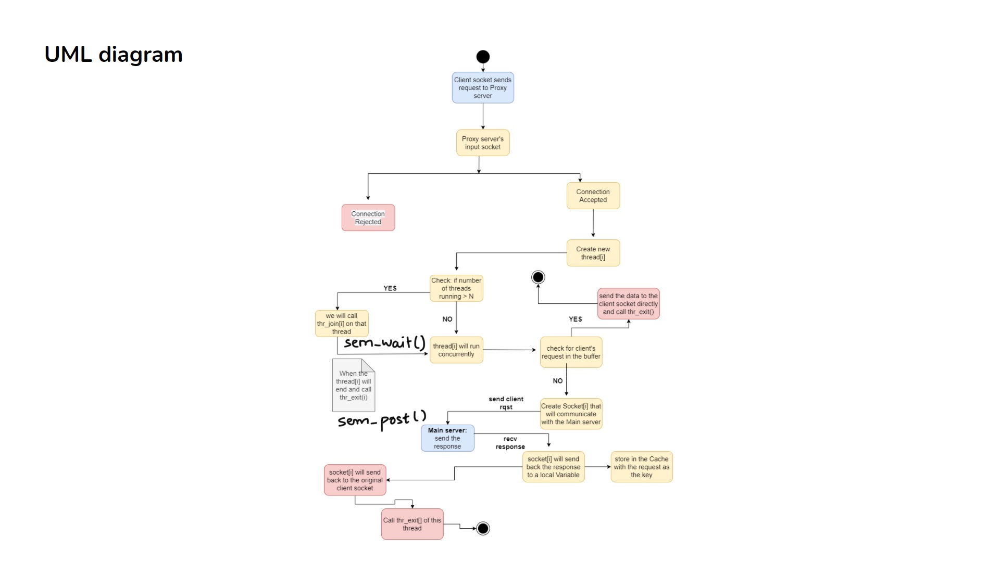
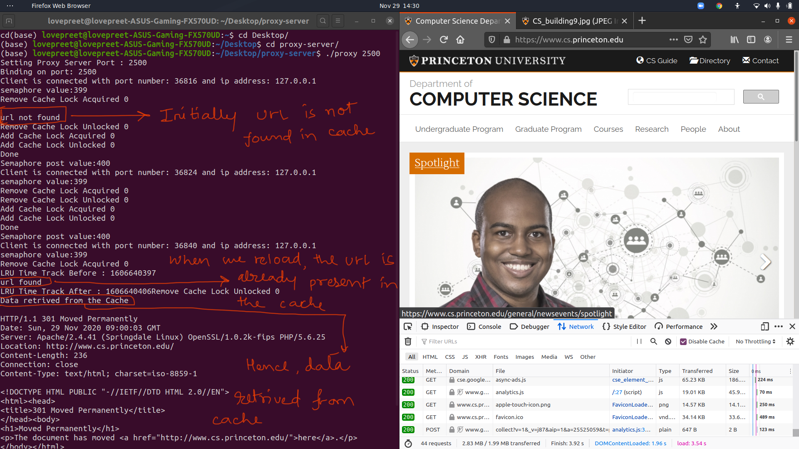

<h1>Multi Threaded Proxy Server with and without Cache</h1>

This project is implemented in `C` and demonstrates HTTP parsing and proxy server concepts.

## Index

- [Project Theory](#project-theory)
- [How to Run](#how-to-run)
- [Demo](#demo)
- [Contributing](#contributing)

## Project Theory

[[Back to top]](#index)

##### Introduction

##### Basic Working Flow of the Proxy Server:


##### How did we implement Multi-threading?
- Used Semaphore instead of Condition Variables and pthread_join() and pthread_exit() function.
- pthread_join() requires us to pass the thread id of the thread to wait for.
- Semaphore’s sem_wait() and sem_post() don’t need any parameter, making them a convenient option.

##### Motivation/Need of Project
- To understand:
  - The working of requests from a local computer to a server.
  - Handling multiple client requests from various clients.
  - Locking procedures for concurrency.
  - The concept of cache and its different functions used by browsers.
- Proxy Server can:
  - Speed up processes and reduce server-side traffic.
  - Restrict users from accessing specific websites.
  - Change the IP so the server doesn’t know about the client who sent the request.
  - Encrypt requests to prevent unauthorized access.

##### OS Components Used
- Threading
- Locks
- Semaphore
- Cache (LRU algorithm is used)

##### Limitations
- If a URL opens multiple clients itself, the cache will store each client’s response as a separate element in the linked list. During retrieval, only a chunk of the response will be sent and the website may not open fully.
- Fixed size of cache element, so large websites may not be stored in cache.

##### How this project can be extended
- Implement multiprocessing to speed up the process with parallelism.
- Decide which types of websites should be allowed.
- Implement additional HTTP methods like POST.

# Note:
- Code is well commented. For any doubt, you can refer to the comments.

## How to Run

```bash
$ git clone <your-repo-url>
$ cd MultiThreadinginC
$ make all
$ ./proxy <port no.>
```
Open `http://localhost:<port>/https://www.cs.princeton.edu/`

# Note:
- This code can only be run on a Linux machine. Please disable your browser cache.
- To run the proxy without cache, change the file name in the Makefile from `proxy_server_with_cache.c` to `proxy_server_without_cache.c`.

## Demo

- When a website is opened for the first time (`url not found`), there will be a cache miss.
- If you open that website again, `Data is retrieved from the cache` will be printed.

